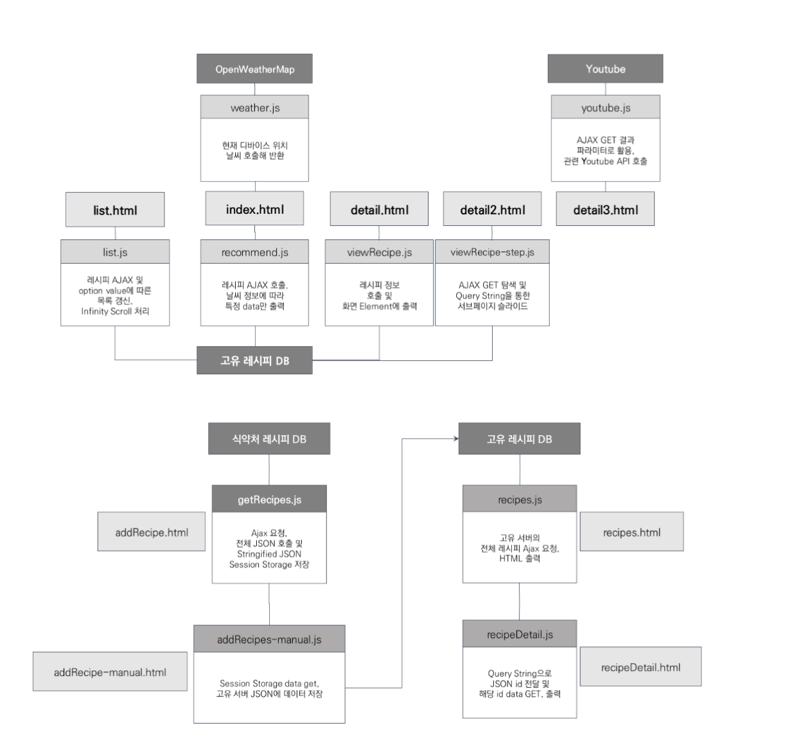

# 🧑‍🍳 창밖의 레시피 
날씨에 따른 메뉴 추천 및 레시피 제공 프로그램
> 2022.10.04~2022.10.07
> 유지인, 서보선, 조준희 (3명)
## 프로젝트 개요
### 사용 Open API
* OpenWeatherMap API https://openweathermap.org/
* 식약처 조리제품 레시피 Open API https://www.foodsafetykorea.go.kr/api/
* Youtube API https://console.cloud.google.com/
### 기술스택
  </a>
  </a>
  </a>
  
### 흐름도

